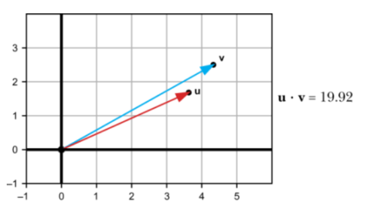
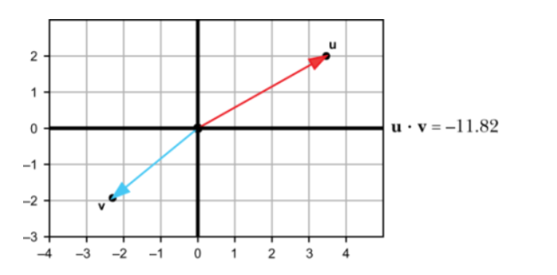

# maths_for_programmers

## references
[maths for programmers] (https://learning.oreilly.com/library/view/math-for-programmers/9781617295355/OEBPS/Text/03.htm#heading_id_15)

## Linear algebra

### vector dot product
#### Definition
The dot product takes two vectors and returns a scalar. You can think of it measuring how aligned two vectors are.  
Two vectors which are pointing in the same direction will have positive dot product.
  
Two vectors which are pointing in the different direction will have negative dot product.   

## Linear algebra - ends
 
