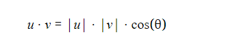
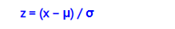

# maths_for_programmers

## references
[maths for programmers] (https://learning.oreilly.com/library/view/math-for-programmers/9781617295355/OEBPS/Text/03.htm#heading_id_15)  
[maths notations in markdown file] (https://ashki23.github.io/markdown-latex.html)  
[statistics on khan academy] (https://www.khanacademy.org/math/ap-statistics)  
## Linear algebra

### vector dot product
#### Definition
The dot product takes two vectors and returns a scalar. You can think of it measuring how aligned two vectors are.  
Two vectors which are pointing in the same direction will have positive dot product.
  
Two vectors which are pointing in the different direction will have negative dot product.   

Computing dot product:
```python
def dot(u,v):
    return sum([coord1 * coord2 for coord1,coord2 in zip(u,v)])

```
```shell script
>>> dot((1,0),(0,2))
0 
>>> dot((0,3,0),(0,0, −5))
0 
```
### Measureing angles with dot product
We’ve seen that the dot product varies based on the angle between two vectors.  
Specifically, the dot product u · v ranges from 1 to −1 times the product of the lengths of u and v as the angle ranges  
from 0 to 180°. We already saw a function that behaves that way, namely the cosine function. It turns out that the dot  
product has an alternate formula. If |u| and |v| denote the lengths of vectors u and v, the dot product is given by:  
  

## Linear algebra - ends

## Statistics
### z-score
[z-score] (https://www.khanacademy.org/math/ap-statistics/density-curves-normal-distribution-ap/measuring-position/v/z-score-introduction)  
[z-score] (https://www.statisticshowto.com/probability-and-statistics/z-score/)  
z-score or standard score is measure of how far from mean a datapoint is. Specifically, it's a measure of how many standard
deviations below or above from mean a datapoint is.  



 
